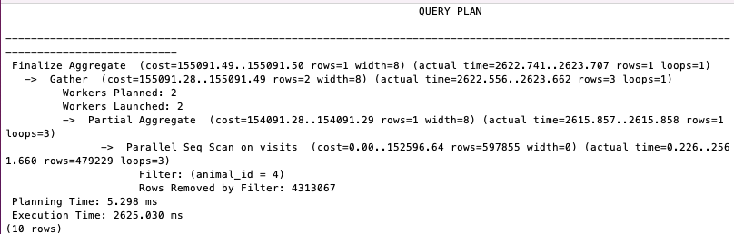
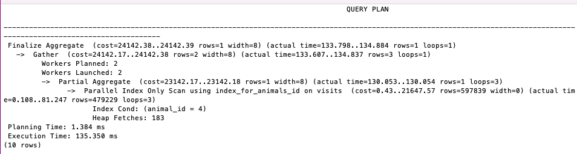

## Vet clinic database: database performance audit

In this project we optimize some slow queries in a postgres database and we achive that using the EXPLAIN ANALYZE to compare the execution times before and after optimization.

## Sample screenshots

| Before Optimization | After Optimization |
| --- | --- |
|  |  |

## Built With

- SQL, PostgreSQL DB
- Tools - VisualStudio Code, Git, & GitHub;

## Getting Started
1. To get a local copy up and running follow these simple steps.

```
git clone https://github.com/Cathella/vet_clinic_database.git
```
2. Inside the postgres terminal, create a database, then run the following queries to create database tables

```
CREATE TABLE owners(
  id INT GENERATED ALWAYS AS IDENTITY,
  full_name VARCHAR(20),
  age INT,
  PRIMARY KEY(id)
);

CREATE TABLE species(
  id INT GENERATED ALWAYS AS IDENTITY,
  name VARCHAR(20),
  PRIMARY KEY(id)
);

CREATE TABLE animals(
  id INT GENERATED ALWAYS AS IDENTITY,
  name VARCHAR(20),
  date_of_birth DATE,
  escape_attempts INT,
  neutered BOOLEAN,
  weight_kg DECIMAL,
  species_id INT REFERENCES species(id),
  owner_id INT REFERENCES owners(id),
  PRIMARY KEY(id)
);

CREATE TABLE vets(
  id INT GENERATED ALWAYS AS IDENTITY,
  name VARCHAR(20),
  age INT,
  date_of_graduation DATE,
  PRIMARY KEY(id)
);

CREATE TABLE specializations(
  id INT GENERATED ALWAYS AS IDENTITY,
  species_id INT REFERENCES species(id),
  vet_id INT REFERENCES vets(id),
  PRIMARY KEY(id)
);

CREATE TABLE visits(
  id INT GENERATED ALWAYS AS IDENTITY,
  animal_id INT REFERENCES animals(id),
  vet_id INT REFERENCES vets(id),
  date_of_visit DATE,
  PRIMARY KEY(id)
);
```

3. Insert data in the tables by running the queries below

```
INSERT INTO animals (name) VALUES ('Agumon'), ('Gabumon'), ('Pikachu'), ('Devimon'), ('Charmander'), ('Plantmon'), ('Squirtle'), ('Angemon'), ('Boarmon'), ('Blossom');

INSERT INTO vets (name) VALUES ('William Tatcher'), ('Maisy Smith'), ('Stephanie Mendez'), ('Jack Harkness');
```

4. Run the following query to add an extra column to the owners table:

```
-- Add an email column to your owners table
ALTER TABLE owners ADD COLUMN email VARCHAR(120);
```

5. Add a significant amount of data. Depending on your machine speed, check the execution times of queries you may think are taking too much time by running "explain analyze" on them.

6. Try optimizing the queries - find ways to reduce execution times and rerun "explain analyze" on them to compare execution times before and after optimization.
## Authors

👤 **Jasem Duncan Valencia**

- GitHub: [@JasemDuncan](https://github.com/JasemDuncan)
- Twitter: [@JasemDuncan](https://twitter.com/JasemDuncan)
- LinkedIn: [@JasemDuncan](https://www.linkedin.com/in/jasem-duncan-valencia/)

👤 **Jasem Duncan Valencia**

- GitHub: [@Cathella](https://github.com/cathella)
- Twitter: [@cathella9](https://twitter.com/cathella9)
- LinkedIn: [Nakitto Catherine](https://www.linkedin.com/in/nakitto-catherine2020/)
## 🤝 Contributing

Contributions, issues, and feature requests are welcome!

Feel
## Show your support

Give a ⭐️ if you like this project!
## Acknowledgments

- Microverse for the guidelines used for this project
- My SO and project manager, Mane
## 📝 License

This project is [MIT](./LICENSE.md) licensed.
